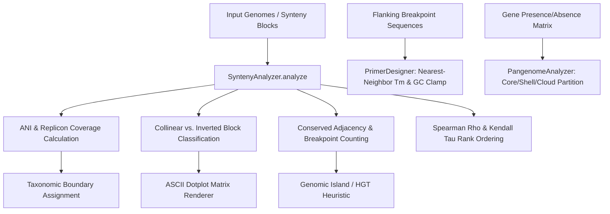

# Bacterial Genome Synteny Agent & Comparative Microbial Genomics Toolkit

[](LICENSE)


An elite, high-performance, pure-Python comparative microbial genomics platform engineered for whole-genome synteny block identification, gene order conservation analysis, inversion breakpoint characterization, operon collinearity assessment, and pangenome core/accessory partitioning.

---

## Table of Contents

- [Overview & Clinical / Scientific Context](#overview--clinical--scientific-context)
- [Algorithmic Architecture & Mathematical Formulations](#algorithmic-architecture--mathematical-formulations)
  - [1. Average Nucleotide Identity (ANI) & Species Delimitation](#1-average-nucleotide-identity-ani--species-delimitation)
  - [2. Conserved Adjacency Score (CAS) & Breakpoint Distance](#2-conserved-adjacency-score-cas--breakpoint-distance)
  - [3. Rank-Order Correlation: Spearman's Rho & Kendall's Tau](#3-rank-order-correlation-spearmans-rho--kendalls-tau)
  - [4. Breakpoint PCR Primer Design Thermodynamics](#4-breakpoint-pcr-primer-design-thermodynamics)
  - [5. Pangenome Core/Accessory Matrix Partitioning](#5-pangenome-coreaccessory-matrix-partitioning)
- [Taxonomic & Genomic Reference Thresholds](#taxonomic--genomic-reference-thresholds)
- [Comparative Benchmark Genome Pairs](#comparative-benchmark-genome-pairs)
- [Installation & Quickstart](#installation--quickstart)
- [Command Line Interface (CLI) Usage](#command-line-interface-cli-usage)
  - [Subcommands & Options](#subcommands--options)
  - [Batch Processing of Comparative Pairs](#batch-processing-of-comparative-pairs)
  - [ASCII Dotplot Matrix Generation](#ascii-dotplot-matrix-generation)
  - [Pangenome Partitioning](#pangenome-partitioning)
  - [PCR Primer Design for Inversions](#pcr-primer-design-for-inversions)
- [Input / Output Data Specifications](#input--output-data-specifications)
- [Python API Quickstart](#python-api-quickstart)
- [Testing & Quality Assurance](#testing--quality-assurance)
- [License](#license)

---

## Overview & Clinical / Scientific Context

Bacterial genome evolution is driven by homologous recombination, horizontal gene transfer (HGT), and large-scale chromosomal rearrangements such as inversions, translocations, and duplications. While 16S rRNA gene sequencing lacks sufficient resolution to distinguish closely related pathogenic lineages (e.g., *Escherichia coli* K-12 commensal vs. *E. coli* O157:H7 enterohemorrhagic strain), whole-genome synteny analysis and Average Nucleotide Identity (ANI) provide definitive taxonomic and epidemiologic classification.

This toolkit implements standardized, pure-Python computational pipelines for:
- **Collinear and Inverted Synteny Block Resolution:** Identifying contiguous genomic anchors and genomic inversions across replichores.
- **Gene Order Collinearity Metrics:** Quantifying syntenic drift using Conserved Adjacency Scores (CAS), Spearman's $\rho$, and Kendall's $\tau$.
- **Genomic Island & Pathogenicity Island (PAI) Anomaly Detection:** Flagging identity-divergent segments and length disparities indicative of mobile genetic elements (prophages, integrative conjugative elements, AMR plasmids).
- **Inversion Breakpoint Validation:** Designing sequence-specific diagnostic PCR primers across rearrangement junctions.
- **Pangenome Trajectory Modeling:** Categorizing gene repertoires into Core, Soft-Core, Shell, and Cloud partitions.

---

## Algorithmic Architecture & Mathematical Formulations



### 1. Average Nucleotide Identity (ANI) & Species Delimitation

The overall sequence identity between two bacterial strains is computed as the segment-length-weighted Average Nucleotide Identity across all aligned syntenic blocks $B$:

$$\text{ANI} = \frac{\sum_{b \in B} L_{\text{ref}}(b) \cdot I(b)}{\sum_{b \in B} L_{\text{ref}}(b)}$$

where:
- $L_{\text{ref}}(b) = |E_{\text{ref}}(b) - S_{\text{ref}}(b)|$ is the span of block $b$ in the reference replicon.
- $I(b)$ is the nucleotide identity percentage of block $b$.

Genome coverage fractions are evaluated relative to total replicon lengths $G_{\text{ref}}$ and $G_{\text{qry}}$:

$$\text{Cov}_{\text{ref}} = \min\left(100.0, \frac{\sum_{b \in B} L_{\text{ref}}(b)}{G_{\text{ref}}} \times 100\right), \quad \text{Cov}_{\text{qry}} = \min\left(100.0, \frac{\sum_{b \in B} L_{\text{qry}}(b)}{G_{\text{qry}}} \times 100\right)$$

### 2. Conserved Adjacency Score (CAS) & Breakpoint Distance

Synteny conservation between ortholog orders is quantified through the conserved adjacency fraction:

$$\text{CAS} = \frac{|\mathcal{A}_{\text{ref}} \cap \mathcal{A}_{\text{qry}}|}{|\mathcal{A}_{\text{ref}}|}$$

where $\mathcal{A}_{\text{ref}}$ is the set of adjacent gene pairs $(g_i, g_{i+1})$ in the reference genome, and $\mathcal{A}_{\text{qry}}$ is the undirected adjacency set in the query genome (considering both forward $(g_i, g_{i+1})$ and reverse $(g_{i+1}, g_i)$ orientation as syntenically conserved).

The breakpoint distance counts the number of disrupted neighbor relations:

$$\text{Breakpoints} = |\mathcal{A}_{\text{ref}}| - |\mathcal{A}_{\text{ref}} \cap \mathcal{A}_{\text{qry}}|$$

### 3. Rank-Order Correlation: Spearman's Rho & Kendall's Tau

To evaluate global replicon collinearity independent of local insertions/deletions, ortholog indices are mapped to rank vectors:

- **Spearman's Rank Correlation ($\rho$):**
  $$\rho = 1 - \frac{6 \sum_{i=1}^n (R_i - Q_i)^2}{n (n^2 - 1)}$$
  where $R_i$ and $Q_i$ are the rank positions of shared ortholog $i$ in the reference and query chromosomes, respectively.

- **Kendall's Rank Correlation ($\tau$):**
  $$\tau = \frac{C - D}{\frac{1}{2} n (n - 1)}$$
  where $C$ is the count of concordant pairs and $D$ is the count of discordant pairs.

### 4. Breakpoint PCR Primer Design Thermodynamics

For experimental validation of genomic inversions or structural rearrangements, flanking oligonucleotides are evaluated for melting temperature ($T_m$) and composition:

- **Wallace / Empirical Salt-Adjusted Melting Temperature:**
  For oligonucleotides $\ge 14$ nucleotides:
  $$T_m = 64.9 + 41.0 \times \frac{N_{\text{GC}} - 16.4}{L}$$
  For oligonucleotides $< 14$ nucleotides:
  $$T_m = 2 \cdot N_{\text{AT}} + 4 \cdot N_{\text{GC}}$$

- **GC Content & 3' Clamp:**
  $$\%GC = \frac{N_{\text{GC}}}{L} \times 100$$
  A 3' GC clamp is enforced if the terminal 3' base is `G` or `C`. Optimal primers require $40\% \le \%GC \le 60\%$, $55^\circ\text{C} \le T_m \le 68^\circ\text{C}$, and $|T_{m,\text{fwd}} - T_{m,\text{rev}}| \le 3.0^\circ\text{C}$.

### 5. Pangenome Core/Accessory Matrix Partitioning

Across a population of $N$ bacterial isolates, gene families are partitioned according to their frequency $f = n_{\text{strains}} / N$:

$$\text{Partition}(f) = \begin{cases}
\text{Core Genome} & f \ge 0.99 \\
\text{Soft Core} & 0.95 \le f < 0.99 \\
\text{Shell Genome} & 0.15 \le f < 0.95 \\
\text{Cloud Genome} & f < 0.15
\end{cases}$$

The pangenome trajectory is classified as **Open** if $(\text{Shell} + \text{Cloud}) > 50\%$ (indicating high accessory diversification driven by HGT), or **Closed** otherwise.

---

## Taxonomic & Genomic Reference Thresholds

In accordance with international microbial systematics guidelines (Richter & Rosselló-Móra 2009, Chun et al. 2018):

| Metric | Species Boundary / Guideline | Biological Interpretation |
|:-------|:-----------------------------|:--------------------------|
| **$\text{ANI} \ge 95.0\% \text{ and Coverage} \ge 60\%$** | Conspecific Cutoff | Strains belong to the same bacterial species |
| **$93.0\% \le \text{ANI} < 95.0\%$** | Subspecies / Borderline Divergence | Subspecies distinction, ecotype specialization, or emerging speciation |
| **$85.0\% \le \text{ANI} < 93.0\%$** | Congeneric Cutoff | Separate species within the same genus |
| **$\text{ANI} < 85.0\%$** | Divergent Family / Order | Higher-level taxonomic divergence |
| **$\text{CAS} = 1.0, \text{Breakpoints} = 0$** | Perfect Collinearity | Completely conserved operon and replicon gene order |
| **$\text{CAS} < 0.70 \text{ or Inversions} > 0$** | Chromosomal Rearrangement | Substantial genome remodeling via homologous recombination / inversion |

---

## Comparative Benchmark Genome Pairs

The toolkit includes curated, gold-standard benchmark bacterial genome comparisons:

| Benchmark ID | Reference Organism | Query Organism | Key Rearrangement Features |
|:---|:---|:---|:---|
| `ecoli_k12_vs_o157` | *Escherichia coli* K-12 MG1655 | *Escherichia coli* O157:H7 EDL933 | Large inversion across replication terminus (`BLK_2_INV`), locus of enterocyte effacement (LEE) island |
| `salmonella_lt2_vs_ct18` | *Salmonella enterica* Typhimurium LT2 | *Salmonella enterica* Typhi CT18 | Inversion flanking pathogenicity island SPI-2 (`SB_2_INV`), Vi capsular locus (`viaB`) |
| `pseudomonas_pao1_vs_lesb58` | *Pseudomonas aeruginosa* PAO1 | *Pseudomonas aeruginosa* LESB58 | Multidrug efflux cluster inversion (`PBLK_3_INV`), genomic island LES prophage insertions |

---

## Installation & Quickstart

The toolkit uses pure Python standard libraries (no heavy C/C++ or external compilation required).

### Prerequisites
- Python 3.10, 3.11, or 3.12

### Installation
```bash
git clone https://github.com/abusuraihsakhri/bacterial-genome-synteny-agent.git
cd bacterial-genome-synteny-agent
pip install .
```

For development and running test suites:
```bash
pip install pytest
```

---

## Command Line Interface (CLI) Usage

The unified CLI binary `cli.py` supports both dedicated subcommands and classic backward-compatible root flags.

### Subcommands & Options

```text
usage: bacterial-genome-synteny-agent [-h] [--benchmark BENCHMARK] [--dotplot]
                                      [--pangenome] [--primers]
                                      [--list-benchmarks] [--interactive]
                                      [--json] [--input ROOT_INPUT]
                                      [--output ROOT_OUTPUT]
                                      {batch,benchmark,pangenome,primers,interactive}
```

### Batch Processing of Comparative Pairs

Process multi-strain or multi-block comparative genomics CSV files into aggregated synteny, ANI, and rearrangement metric reports:

```bash
# Using the batch subcommand
python cli.py batch --input sample.csv --output out_results.csv

# Using short flags
python cli.py batch -i sample.csv -o out_results.csv

# Output summary as structured JSON
python cli.py batch -i sample.csv -o out_results.csv --json

# Direct root option compatibility
python cli.py -i sample.csv -o out_results.csv
```

### ASCII Dotplot Matrix Generation

Visualize whole-chromosome synteny alignments and inversion X-patterns directly in the console:

```bash
python cli.py benchmark ecoli_k12_vs_o157 --dotplot
```

*Dotplot Key:*
- `\` indicates forward collinear alignment.
- `/` indicates reverse-complemented inverted alignment.
- `.` indicates unaligned sequence space.

### Pangenome Partitioning

Partition multi-strain gene frequency matrices into core, soft-core, shell, and cloud categories:

```bash
python cli.py pangenome --json
```

### PCR Primer Design for Inversions

Design validation primers spanning a suspected inversion or rearrangement breakpoint:

```bash
python cli.py primers --left GATCGATCAGCTGAGCGTGAACGTGACC --right GGGTGAACGACACTGACGGTGATCGATC --json
```

---

## Input / Output Data Specifications

### Input Batch CSV Schema (`sample.csv`)

| Column Header | Data Type | Required | Description / Example |
|:---|:---|:---|:---|
| `pair_id` | String | Yes | Unique identifier for the genome pair comparison (e.g., `PAIR_001_ECOLI`) |
| `reference_name` | String | Yes | Name of reference genome strain (e.g., `Escherichia coli K-12 MG1655`) |
| `query_name` | String | Yes | Name of query genome strain (e.g., `Escherichia coli O157:H7 EDL933`) |
| `ref_genome_length`| Integer | Yes | Total length of reference replicon in bp (e.g., `4641652`) |
| `qry_genome_length`| Integer | Yes | Total length of query replicon in bp (e.g., `5528445`) |
| `block_id` | String | Yes | Identifier for the syntenic block (e.g., `BLK_02_INV_TER`) |
| `ref_start` | Integer | Yes | Start coordinate on reference replicon |
| `ref_end` | Integer | Yes | End coordinate on reference replicon |
| `qry_start` | Integer | Yes | Start coordinate on query replicon |
| `qry_end` | Integer | Yes | End coordinate on query replicon |
| `strand` | String | Yes | Alignment strand (`+` for forward, `-` for inverted) |
| `identity_pct` | Float | Yes | Sequence nucleotide identity percentage (e.g., `98.4`) |
| `ref_genes` | String | No | Semicolon-delimited list of reference genes (e.g., `dnaA;dnaN;gyrB`) |
| `qry_genes` | String | No | Semicolon-delimited list of query genes (e.g., `dnaA;dnaN;gyrB`) |
| `event_type` | String | No | Event annotation (`collinear`, `inversion`, `translocation`) |

### Output Batch CSV Schema

| Column Header | Description |
|:---|:---|
| `pair_id` | Unique comparison identifier |
| `reference_name` | Reference organism identifier |
| `query_name` | Query organism identifier |
| `ref_genome_length` | Replicon length of reference |
| `qry_genome_length` | Replicon length of query |
| `num_blocks` | Total number of syntenic alignment blocks identified |
| `collinear_blocks` | Number of forward collinear blocks (`+`) |
| `inverted_blocks` | Number of inverted blocks (`-`) |
| `ani_pct` | Length-weighted Average Nucleotide Identity percentage |
| `ref_coverage_pct` | Aligned fraction of reference genome (%) |
| `qry_coverage_pct` | Aligned fraction of query genome (%) |
| `taxonomic_call` | Taxonomic boundary classification |
| `conserved_adjacency_score` | Fraction of adjacent ortholog pairs conserved ($0.0 - 1.0$) |
| `spearman_rho` | Spearman rank correlation of ortholog order ($-1.0 \text{ to } +1.0$) |
| `kendall_tau` | Kendall rank correlation of ortholog order ($-1.0 \text{ to } +1.0$) |
| `breakpoint_count` | Number of disrupted chromosomal neighbor junctions |
| `genomic_island_candidates` | Count of regions exhibiting identity drops or length disparity |
| `synteny_status` | Status call (`CONSERVED_SYNTENY`, `REARRANGED_INVERSIONS`, `PARTIALLY_CONSERVED`) |

---

## Python API Quickstart

```python
from bacterial_genome_synteny import (
    SyntenyBlock,
    SyntenyAnalyzer,
    DotplotRenderer,
    PrimerDesigner,
    PangenomeAnalyzer,
)

# 1. Define Synteny Blocks between two strains
blocks = [
    SyntenyBlock("B1", 0, 1_000_000, 0, 1_050_000, "+", 99.2, ["dnaA", "gyrB"], ["dnaA", "gyrB"]),
    SyntenyBlock("B2_INV", 1_000_000, 2_500_000, 4_000_000, 2_600_000, "-", 98.1, ["lacZ", "trpA"], ["trpA", "lacZ"]),
]

# 2. Run Comprehensive Synteny Analysis
result = SyntenyAnalyzer.analyze(
    reference_name="Strain A",
    query_name="Strain B",
    ref_length=4_500_000,
    qry_length=4_700_000,
    blocks=blocks,
)

print(f"ANI: {result.ani_pct}%")
print(f"Taxonomic Call: {result.taxonomic_call}")
print(f"Conserved Adjacency Score: {result.conserved_adjacency_score}")
print(f"Inverted Blocks: {result.inverted_blocks}")

# 3. Render 2D ASCII Dotplot
dotplot = DotplotRenderer.render(blocks, 4_500_000, 4_700_000, grid_size=25)
print(dotplot)

# 4. Design Inversion Breakpoint Validation PCR Primers
primers = PrimerDesigner.design_flanking_primers(
    left_flank_seq="GATCGATCAGCTGAGCGTGAACGTGACC",
    right_flank_seq="GGGTGAACGACACTGACGGTGATCGATC",
)
print("Forward Primer:", primers["forward_primer"]["sequence"], "Tm:", primers["forward_primer"]["tm_c"])
print("QC Passed:", primers["overall_qc_passed"])

# 5. Pangenome Partitioning
matrix = {
    "core_gene": {"S1", "S2", "S3"},
    "accessory_gene": {"S1"},
}
pangenome = PangenomeAnalyzer.partition(matrix)
print("Core Families:", pangenome["core_families"])
```

---

## Testing & Quality Assurance

The test suite validates statistical correctness, boundary conditions, edge cases, and CLI functionality:

```bash
# Run pytest test suite without zarr plugin interference
python -m pytest -p no:zarr -v

# Run standalone CLI batch smoke test
python cli.py batch -i sample.csv -o out_smoke.csv
```

All 34 unit tests cover:
- Syntenic block coordinate spanning and inversion identification
- ANI calculation and taxonomic delimitation cutoffs
- Spearman's $\rho$ and Kendall's $\tau$ correlation algorithms
- Conserved adjacency score and breakpoint distance counting
- 2D ASCII dotplot rendering fidelity
- Primer $T_m$, GC percentage, GC clamp, and delta $T_m$ validation
- Pangenome core/shell/cloud categorization
- CLI subcommand parsing, JSON serialization, and batch CSV transformations

---

## License

This project is licensed under the terms of the [MIT License](LICENSE).
